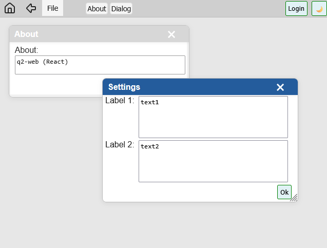

# Q2-Web

Q2-Web is a React-based UI framework designed for building dynamic, data-driven interfaces through simple configuration objects instead of JSX. It enables rapid creation of forms, dialogs, and data grids with minimal code, making it ideal for applications that require a high degree of flexibility and customization.

Demo/Test page - https://datatodoc.de/q2report-editor



## Features

- **Declarative Configuration**: Define UI components using configuration objects.
- **Rapid Development**: Create forms, dialogs, and data grids with minimal effort.
- **Customizable**: Easily configure properties like buttons, toolbars, and controls.
- **React Integration**: Seamlessly integrates with React applications.

## Example Usage

Below is an example of how to use Q2-Web to create a simple application with a menu containing "About" and "Settings" dialogs:

```typescript
import React from "react";
import { Q2App, Q2Form } from "q2-web";

function App() {
  const fileMenu: Q2Form[] = [];

  const fileMenuAbout = new Q2Form("File|About", "About", "about", {
    menutoolbar: true,
    hasMaxButton: false,
    hasOkButton: true,
  });
  fileMenuAbout.add_control("/v");
  fileMenuAbout.add_control("text", "About", {
    readonly: true,
    data: "q2-web (React)",
    control: "text",
  });

  const fileMenuDialog = new Q2Form("File|Dialog", "Settings", "dialog", {
    menutoolbar: true,
    hasMaxButton: false,
    hasOkButton: true,
  });
  fileMenuDialog.add_control("/f");
  fileMenuDialog.add_control("text", "Label 1", {
    readonly: true,
    data: "text1",
    control: "text",
  });
  fileMenuDialog.add_control("text", "Label 2", {
    readonly: true,
    data: "text2",
    control: "text",
  });

  fileMenu.push(fileMenuAbout);
  fileMenu.push(fileMenuDialog);

  return <Q2App q2forms={fileMenu} />;
}

export default App;
```

## Documentation

For detailed documentation and API references, please visit the [official documentation](#).
